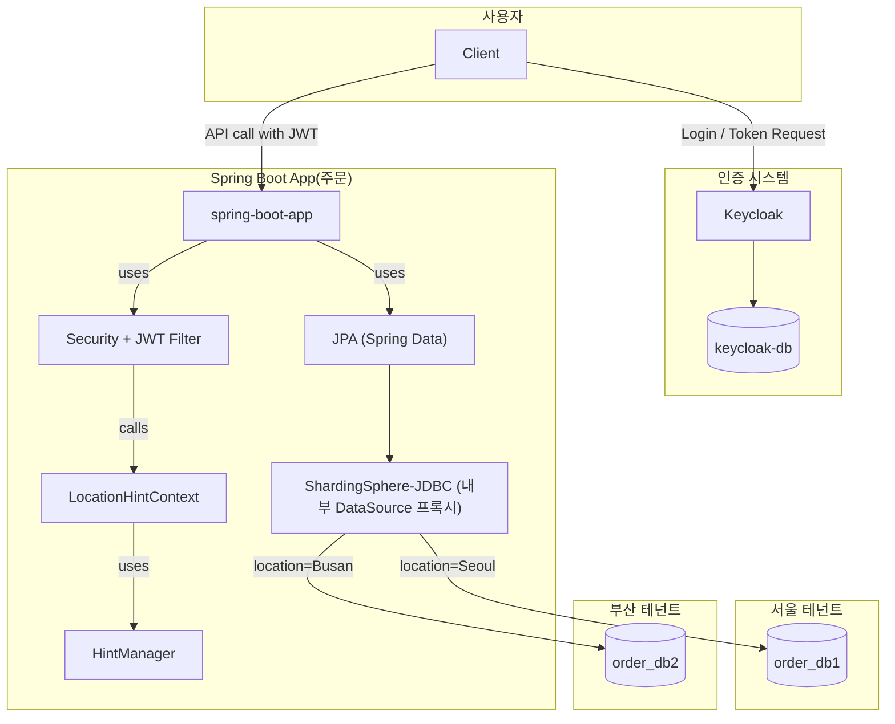
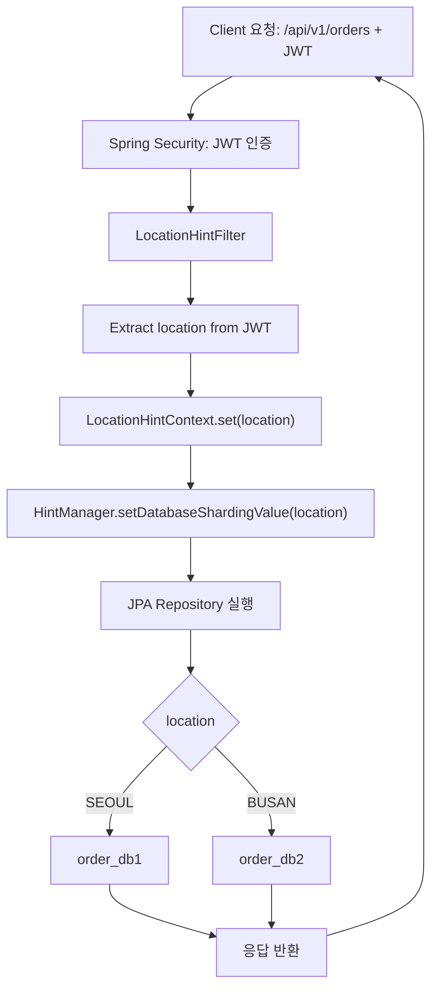

# Sharding Sphere Sample

- [Sharding Sphere Sample](#sharding-sphere-sample)
  - [아키텍처](#아키텍처)
    - [컴포넌트 다이어그램](#컴포넌트-다이어그램)
    - [플로우차트](#플로우차트)
  - [실행 방법](#실행-방법)
    - [도커 및 App 실행](#도커-및-app-실행)
    - [api 테스트](#api-테스트)
  - [개발 관련](#개발-관련)
    - [프로젝트 생성](#프로젝트-생성)
    - [Keycloak 설정](#keycloak-설정)

## 아키텍처

### 컴포넌트 다이어그램



### 플로우차트



## 실행 방법

### 도커 및 App 실행

```bash
docker-compose up
```

```bash
mvn spring-boot:run
```

### api 테스트

user1, location=Seoul 인 사용자의 jwt 정보

```json
{  
  "scope": "profile email",
  "sid": "bd1a7a81-027d-4247-b24d-9cbf82b238c0",
  "email_verified": false,
  "name": "Tom Kim",
  "location": "Seoul",
  "preferred_username": "user1",
  "given_name": "Tom",
  "family_name": "Kim",
  "email": "user1@localhost.com"
}
```

```bash
TOKEN=$(curl -s -X POST http://localhost:8081/realms/store/protocol/openid-connect/token \
  -d "grant_type=password" \
  -d "client_id=store-oidc" \
  -d "username=user1" \
  -d "password=test" \
  -H "Content-Type: application/x-www-form-urlencoded" \
  | jq -r .access_token)
```

```bash
curl -H "Authorization: Bearer $TOKEN" http://localhost:8080/api/v1/orders
```

결과

```json
[
    {
        "id": 1,
        "productName": "Keyboard",
        "quantity": 2,
        "createdAt": "2025-05-19T05:37:46.522307"
    },
    {
        "id": 2,
        "productName": "Mouse",
        "quantity": 1,
        "createdAt": "2025-05-19T05:37:46.522307"
    },
    {
        "id": 3,
        "productName": "Monitor",
        "quantity": 1,
        "createdAt": "2025-05-19T05:37:46.522307"
    }
]
```

user2, location=Busan 인 사용자의 jwt 정보

```json
{
  "sid": "11f8829f-083b-45b1-9353-ed78245df0dc",
  "email_verified": false,
  "name": "James Yim",
  "location": "Busan",
  "preferred_username": "user2",
  "given_name": "James",
  "family_name": "Yim",
  "email": "user2@localhost.com"
}
```

```bash
TOKEN=$(curl -s -X POST http://localhost:8081/realms/store/protocol/openid-connect/token \
  -d "grant_type=password" \
  -d "client_id=store-oidc" \
  -d "username=user2" \
  -d "password=test" \
  -H "Content-Type: application/x-www-form-urlencoded" \
  | jq -r .access_token)
```

```bash
curl -H "Authorization: Bearer $TOKEN" http://localhost:8080/api/v1/orders
```

결과

```json
[
    {
        "id": 1,
        "productName": "키보드",
        "quantity": 10,
        "createdAt": "2025-05-19T05:37:46.569197"
    },
    {
        "id": 2,
        "productName": "마우스",
        "quantity": 3,
        "createdAt": "2025-05-19T05:37:46.569197"
    },
    {
        "id": 3,
        "productName": "모니터",
        "quantity": 153,
        "createdAt": "2025-05-19T05:37:46.569197"
    }
]
```

이와 같이 SQL 은 그대로이지만 사용자 정보의 특정 위치 정보에 따라 DB 가 분산되도록 구현할 수 있다.

## 개발 관련

### 프로젝트 생성

```bash
curl https://start.spring.io/starter.tgz \
  -d type=maven-project \
  -d baseDir=shardingsphere-sample \
  -d language=java \
  -d bootVersion=3.3.11 \
  -d groupId=io.sskk \
  -d artifactId=shardingsphere-sample \
  -d name=shardingsphere-sample \
  -d packaging=jar \
  -d javaVersion=17 \
  -d dependencies=web \
  -o shardingsphere-sample.tgz \
  && tar -xzvf shardingsphere-sample.tgz
```

### Keycloak 설정

Realm 테스트 데이터 생성 후 import 하는 방법

바로 도커 명령으로 export 할 수 있음

```bash
docker exec -it keycloak /opt/keycloak/bin/kc.sh export \
  --dir /opt/keycloak/data/export \
  --realm store \
  --users realm_file
```

```bash
docker cp keycloak:/opt/keycloak/data/export ./exported-realm
```