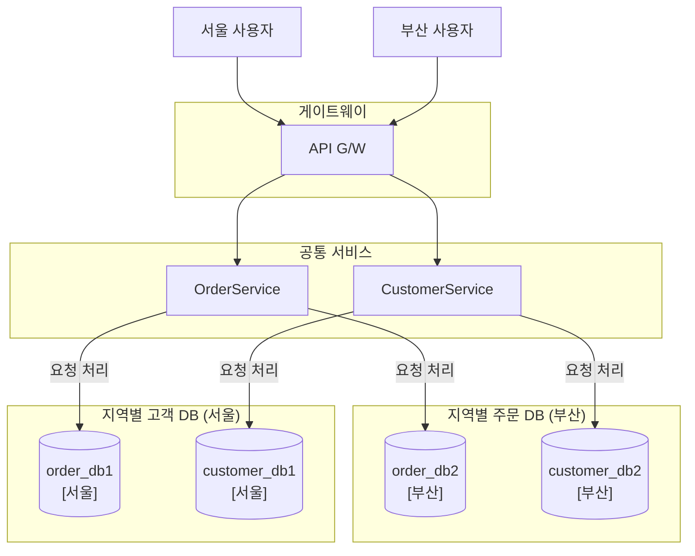
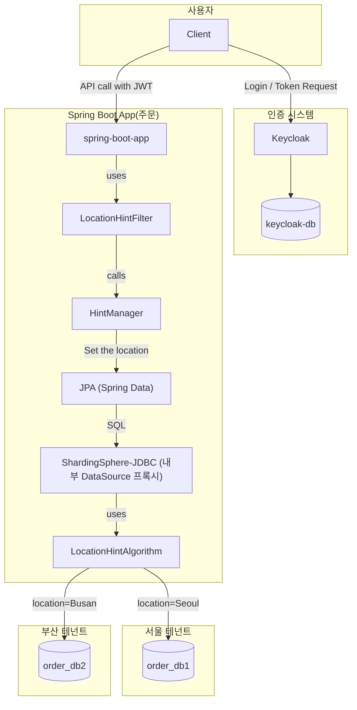
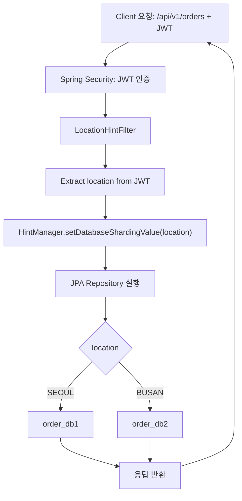

# Sharding Sphere Sample

- [Sharding Sphere Sample](#sharding-sphere-sample)
  - [개요](#개요)
  - [아키텍처](#아키텍처)
    - [컴포넌트 다이어그램](#컴포넌트-다이어그램)
    - [플로우차트](#플로우차트)
  - [실행 방법](#실행-방법)
    - [도커 및 App 실행](#도커-및-app-실행)
    - [api 테스트](#api-테스트)
  - [개발 관련](#개발-관련)
    - [프로젝트 생성](#프로젝트-생성)
    - [Keycloak 설정](#keycloak-설정)
  - [결론](#결론)

## 개요

과제의 제약 사항으로 데이터베이스는 지역별로 별도로 구성되어야 했으며, 비용 절감 및 유지보수 효율성 측면에서 시스템은 여러 개의 서비스를 가지되 각 서비스는 지역별로 공통 서비스가 되어야 했습니다. 이 상황에서는 고려할 수 있는 아키텍처는 다음과 같을 것입니다.



그리고 한가지 더 중요한 요구사항은 SQL 에 개발자가 특정 구분자를 where 조건에 주는 것은 지양해야 했습니다. 왜냐하면 기존의 시스템 개발 코드를 재사용하려니 SQL 은 가급적 변화를 주지 않길 원했기 때문입니다.

여기에서 기술적으로 사용자 지역에 따른 DB 요청 분산을 할 때 사용할 수 있는 후보는 다음을 생각할 수 있습니다.

1. JDBC 를 이용한 직접 구현
2. JPA/Hibernate 를 이용한 직접 구현
3. 샤딩스피어를 이용한 구현

직접 구현하는 것도 가능은 하겠으나 아무래도 성능/안정성 측면에서 지양해야할 것 같아서 이러한 상황에 사용할 수 있는 샤딩스피어를 이용해 보기로 하였습니다.

샤딩스피어를 이용하는 방법은 다음의 두가지가 있습니다.

✅ ShardingSphere 2가지 동작 방식

| 방식 | 설명 |
| -- | -- |
| 🟢 **ShardingSphere-JDBC**  | Java 애플리케이션 내에서 JDBC DataSource를 프록시하여 SQL을 가로채고 처리하는 **경량 라이브러리** 형태 |
| 🟠 **ShardingSphere-Proxy** | MySQL/PostgreSQL 프로토콜을 처리하는 **독립적인 서버 프로세스**로 동작하는 프록시 DB 서버

📊 ShardingSphere-JDBC vs. Proxy 비교 테이블

| 항목 | ShardingSphere-JDBC | ShardingSphere-Proxy |
|--|--|--|
| 🧩 통합 방식 | 애플리케이션 내에 내장 (라이브러리) | DB 앞단에 위치한 별도 서버 (프록시) |
| 🧪 대상 언어 | **Java 애플리케이션 전용** | 모든 언어/클라이언트 (MySQL/PostgreSQL 호환) |
| ⚙️ 설정 위치 | Spring Boot, JPA 등에서 설정 (`application.yml`) | Proxy 서버 설정 파일 (`server.yaml`) |
| 📡 연결 방식 | `DataSource`를 통해 직접 연결 | JDBC URL을 Proxy 주소로 변경 (`jdbc:mysql://proxy-host:3307`) |
| 🔁 배포 구조 | 애플리케이션 안에 포함 (모놀리식) | 별도 프로세스/컨테이너로 분리 가능 (마이크로서비스에 유리) |
| 🔄 확장성 | 애플리케이션 수만큼 설정 필요 | 모든 앱이 동일 프록시를 공유 가능 |
| 📚 학습 및 관리 난이도 | 낮음 (Spring과 자연스럽게 통합됨) | 비교적 높음 (서버 설정/운영 필요) |
| 📈 성능 | 빠름 (내부 호출, 네트워크 없음) | 느릴 수 있음 (네트워크 hop + 프록시 처리) |
| 🔐 보안 구성 | 애플리케이션 자체에서 처리 | 프록시 서버 단위로 처리 가능 (IP 접근 제어 등) |
| 🧵 트랜잭션 | JVM 내 로컬 트랜잭션만 가능 (XA 지원 없음) | XA, Seata 기반 분산 트랜잭션 가능 |
| 🧰 사용 사례 | Spring Boot, JPA + 샤딩/읽기-쓰기 분리 | 다국어 앱, API 서버, BI 도구 연동 등 다양한 클라이언트 환경 |
| 🧪 로깅/추적 | 로컬에서 debug 가능 | Proxy 서버에서 중앙집중 로깅 가능 |
| 📦 도입 용이성 | 빠르고 간단 | 프록시 서버 구성, 포트 설정 필요 |

이 예제에서는 빠르고 간단한 ShardingSphere-JDBC 를 이용하여 구현하겠습니다.

DB 분배는 ShardingShpere 를 이용하고, 한가지 중요한 요구사항, SQL 의 수정을 필요치 않도록 하기 위한 다른 해결방법이 필요했습니다. 이는 SQL 에 hint 를 기반으로 분배하게 하고고, 이를 자동으로 주입하거나 설정하면 SQL 을 수정할 필요가 없어집니다.

✅ Hint 기반 멀티 DB 분기 SQL 문법

```sql
/*+ sharding:ds=ds1 */ SELECT * FROM orders;
```

위와 같이 hint 를 토대로 `ds1` DB 또는 `ds2` DB 로 분기를 수행할 수 있습니다. 이는 SQL 의 변경을 요구하지 않습니다.

이를 토대로 구현한 아키텍처와 동작 방식은 다음 장에서 다루겠습니다.

## 아키텍처

### 컴포넌트 다이어그램

컴포넌트 다이어 그램은 다음과 같습니다.

|컴포넌트|설명|
|--|--|
|Client|사용자를 의미|
|keycloak|OIDC 로서 사용자 인증 및 JWT 생성|
|keycloak-db|Keycloak 전용 데이터베이스|
|Spring-boot-app|주문 API 를 구현하는 Spring 애플리케이션|
|LocationHintFilter|HTTP 요청에 대해 매번 수행되며 JWT 에서 location 값을 추출|
|HintManager|DB 분기시 조건 값인 location 을 설정|
|JPA|객체 기반 SQL 조회 라이브러리|
|ShardingSphere-JDBC|JDBC 로 DB 연결 및 SQL 실행|
|LocationHintAlgorithm|location 값에 다른 Target DB 를 결정하는 알고리즘|
|order_db1|서울 지역 주문 테이블을 가지는 데이터베이스|
|order_db2|부산 지역 주문 테이블을 가지는 데이터베이스|



### 플로우차트

호출 흐름은 다음과 같습니다.



## 실행 방법

Keycloak, keycloak DB, order_db1, order_db2 는 docker-compose 로 구성을 하였으며, 이를 실행한 후에 Spring Boot App 을 실행하면 예제를 수행할 수 있습니다.

### 도커 및 App 실행

다음 명령으로 keycloak, keycloak DB, Postgres (order_db1, order_db2 데이터베이스 및 order 테이블, 초기 데이터) 를 실행 시킵니다. Keycloak 에는 store 테넌트, user1, user2 정보가 모두 세팅됩니다.

```bash
docker-compose up
```

Order API를 제공하는 Spring Boot App 을 실행시킵니다.

```bash
mvn spring-boot:run
```

### api 테스트

docker-compose 및 spring-boot app 이 모두 실행된 상태에서 로그인 및 API 호출을 통해서 DB 가 분기되는지를 확인할 수 있습니다.

user1, location=Seoul 인 사용자의 jwt 정보는 다음과 같습니다. 이 정보는 로그인 명령을 curl 로 수행한 후 JWT Token 의 내용을 일부 발췌한 것입니다.

```json
{  
  "scope": "profile email",
  "sid": "bd1a7a81-027d-4247-b24d-9cbf82b238c0",
  "email_verified": false,
  "name": "Tom Kim",
  "location": "Seoul",
  "preferred_username": "user1",
  "given_name": "Tom",
  "family_name": "Kim",
  "email": "user1@localhost.com"
}
```

먼저 user1 의 JWT 토큰을 얻습니다. 토큰 정보는 `TOKEN` 환경 변수에 저장됩니다.

```bash
TOKEN=$(curl -s -X POST http://localhost:8081/realms/store/protocol/openid-connect/token \
  -d "grant_type=password" \
  -d "client_id=store-oidc" \
  -d "username=user1" \
  -d "password=test" \
  -H "Content-Type: application/x-www-form-urlencoded" \
  | jq -r .access_token)
```

환경 변수에 저장된 `TOKEN` 을 가지고 API 를 호출합니다.

```bash
curl -H "Authorization: Bearer $TOKEN" http://localhost:8080/api/v1/orders
```

API 를 호출하면, user1 의 location 은 `Seoul`이기 때문에 `ds1` 즉, `order_db1`에 있는 order 테이블의 정보를 조회합니다.

결과

```json
[
    {
        "id": 1,
        "productName": "Keyboard",
        "quantity": 2,
        "createdAt": "2025-05-19T05:37:46.522307"
    },
    {
        "id": 2,
        "productName": "Mouse",
        "quantity": 1,
        "createdAt": "2025-05-19T05:37:46.522307"
    },
    {
        "id": 3,
        "productName": "Monitor",
        "quantity": 1,
        "createdAt": "2025-05-19T05:37:46.522307"
    }
]
```

location 이 다른 user2 에 대해서 테스트 해보겠습니다.

user2, location=Busan 인 사용자의 jwt 정보 예시

```json
{
  "sid": "11f8829f-083b-45b1-9353-ed78245df0dc",
  "email_verified": false,
  "name": "James Yim",
  "location": "Busan",
  "preferred_username": "user2",
  "given_name": "James",
  "family_name": "Yim",
  "email": "user2@localhost.com"
}
```

curl 명령으로 TOKEN을 획득합니다.

```bash
TOKEN=$(curl -s -X POST http://localhost:8081/realms/store/protocol/openid-connect/token \
  -d "grant_type=password" \
  -d "client_id=store-oidc" \
  -d "username=user2" \
  -d "password=test" \
  -H "Content-Type: application/x-www-form-urlencoded" \
  | jq -r .access_token)
```

앞에서 획득한 토큰으로 oders api 를 호출합니다.

```bash
curl -H "Authorization: Bearer $TOKEN" http://localhost:8080/api/v1/orders
```

결과는 location 이 `Busan`이기 때문에 ds1, 즉 `order_db2`에 있는 order 테이블 정보를 얻는 것을 확인할 수 있습니다.

```json
[
    {
        "id": 1,
        "productName": "키보드",
        "quantity": 10,
        "createdAt": "2025-05-19T05:37:46.569197"
    },
    {
        "id": 2,
        "productName": "마우스",
        "quantity": 3,
        "createdAt": "2025-05-19T05:37:46.569197"
    },
    {
        "id": 3,
        "productName": "모니터",
        "quantity": 153,
        "createdAt": "2025-05-19T05:37:46.569197"
    }
]
```

이와 같이 SQL 은 그대로이지만 사용자 정보의 특정 위치 정보에 따라 DB 가 분산되도록 구현할 수 있다.

## 개발 관련

### 프로젝트 생성

```bash
curl https://start.spring.io/starter.tgz \
  -d type=maven-project \
  -d baseDir=shardingsphere-sample \
  -d language=java \
  -d bootVersion=3.3.11 \
  -d groupId=io.sskk \
  -d artifactId=shardingsphere-sample \
  -d name=shardingsphere-sample \
  -d packaging=jar \
  -d javaVersion=17 \
  -d dependencies=web \
  -o shardingsphere-sample.tgz \
  && tar -xzvf shardingsphere-sample.tgz
```

### Keycloak 설정

Realm 테스트 데이터 생성 후 import 하는 방법

바로 도커 명령으로 export 할 수 있음

```bash
docker exec -it keycloak /opt/keycloak/bin/kc.sh export \
  --dir /opt/keycloak/data/export \
  --realm store \
  --users realm_file
```

```bash
docker cp keycloak:/opt/keycloak/data/export ./exported-realm
```

## 결론

개요에서 소개한 다음 문제를 ShardingSphere 와 SQL Hint 를 이용하여 해결하였습니다.

1. 특정 정보에 따른 DB 분기 (지역별 등)
2. 분기를 위한 SQL 수정을 요구하지 않음

PoC 로 이러한 문제를 해결하는 예제를 만들어 보았습니다. 여기에서 추가적으로 검토할 수 있는 것들은 다음과 같습니다.

- shardingsphere-jdbc 가 아니라 shardingsphere-proxy 를 통한 분배도 고려해 볼 수 있습니다.
- 성능 테스트

이상으로 글을 마치겠습니다.
